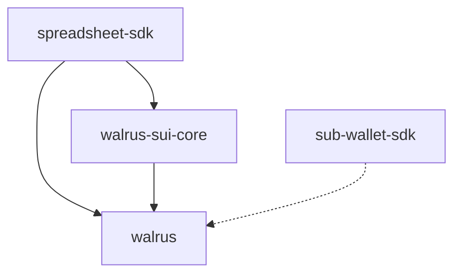

# Dreamlit Walrus SDK

A collection of enterprise-grade SDKs for building on Walrus and Sui blockchain.

## Packages

This monorepo contains four SDKs for different use cases:

### 1. [@dreamlit/walrus](./walrus)

**Core Walrus storage adapter for browser and Node.js environments**

**🎯 Key Features:**
- Store and retrieve data on Walrus decentralized storage
- Browser and Node.js support with environment-specific optimizations
- Health monitoring and endpoint failover
- Automatic retry with exponential backoff
- Rate limiting and circuit breaker patterns
- Blob range reading and streaming
- PoA (Proof of Availability) certificate support

**Installation:**
```bash
npm install @dreamlit/walrus
# or
bun add @dreamlit/walrus
```

**Quick Start:**
```typescript
import { BrowserWalrusService } from '@dreamlit/walrus';

const walrusService = new BrowserWalrusService();
const blob = new Blob(['Hello Walrus!'], { type: 'text/plain' });
const result = await walrusService.store(blob, { epochs: 5 });
console.log('Stored at blob ID:', result.blobId);
```

See the [walrus documentation](./walrus/README.md) for complete API reference.

---

### 2. [@dreamlit/walrus-sui-core](./walrus-sui-core)

**Walrus + Sui blockchain integration core with CLI compatibility**

**🎯 Key Features:**
- Dual environment support (Node.js/CLI and browser)
- Complete Sui blockchain interaction layer
- Transaction management with queueing, tracking, and retry logic
- Offline transaction support
- PoA certification and blob lineage tracking
- Browser wallet integration (browser entry only)
- GraphQL and GRPC support for high-performance operations

**Installation:**
```bash
npm install @dreamlit/walrus-sui-core @dreamlit/walrus
# or
bun add @dreamlit/walrus-sui-core @dreamlit/walrus
```

**Quick Start:**
```javascript
import { nodeWalrusService, suiService } from '@dreamlit/walrus-sui-core/node';

// For browser environments
import { BrowserSuiService } from '@dreamlit/walrus-sui-core/browser';
```

See the [walrus-sui-core documentation](./walrus-sui-core/README.md) for entry points and advanced usage.

---

### 3. [@dreamlit/spreadsheet-sdk](./spreadsheet-sdk)

**React SDK for building Walrus-powered spreadsheet applications**

**🎯 Key Features:**
- Complete React hooks for spreadsheet state management
- Pre-built UI components with Walrus/Sui integration
- Luckysheet-powered rich spreadsheet functionality
- Built-in blockchain adapters and services
- Custom formula engine with Sui-specific formulas
- CSV/Excel import/export with Walrus storage
- Automatic saving with blockchain versioning
- Multi-wallet and multi-network support

**Installation:**
```bash
npm install @dreamlit/spreadsheet-sdk @dreamlit/walrus @dreamlit/walrus-sui-core react react-dom
# or
bun add @dreamlit/spreadsheet-sdk @dreamlit/walrus @dreamlit/walrus-sui-core react react-dom
```

**Quick Start:**
```jsx
import {
  SpreadsheetProvider,
  Spreadsheet,
  Header,
  StatusBar
} from '@dreamlit/spreadsheet-sdk';
import '@dreamlit/spreadsheet-sdk/dist/index.css';

function App() {
  return (
    <SpreadsheetProvider>
      <div className="app-container">
        <Header />
        <Spreadsheet />
        <StatusBar />
      </div>
    </SpreadsheetProvider>
  );
}
```

See the [spreadsheet-sdk documentation](./spreadsheet-sdk/README.md) for components and API reference.

---

### 4. [@walrus/subwallet-sdk](./sub-wallet-sdk)

**Comprehensive SDK for managing sub-wallet fleets on Sui/Walrus**

**🎯 Key Features:**
- **Automatic Sponsor Wallet Bootstrapping** - Wallet 0 auto-synced with Sui CLI
- **Protected Sponsor Wallet** - Wallet 0 cannot be deleted, always funded
- **Sponsored Transactions** - Gasless operations for all worker wallets
- **Move Contract Integration** - On-chain policy enforcement and auditing
- **CLI with Plugin System** - Extend functionality with custom commands
- **Intelligent Configuration** - Auto-loads from Sui CLI with override support
- **Browser & Node.js** - Works everywhere with pluggable storage adapters

**🛡️ Safety Architecture:**
```
┌─────────────────────────────────────────┐
│         Wallet Protection Layer         │
├─────────────────────────────────────────┤
│  Wallet 0 (Sponsor)                     │
│  ✓ Synced with Sui CLI active address  │
│  ✓ Protected from deletion             │
│  ✓ Can hold funds                       │
│  ✓ Pays gas for all operations         │
├─────────────────────────────────────────┤
│  Wallets 1-N (Workers)                  │
│  ✓ Deletable only when balance = 0     │
│  ✓ Use sponsored transactions           │
│  ✓ Auto-sweep before bulk clear         │
└─────────────────────────────────────────┘
```

**Installation:**
```bash
npm install @walrus/subwallet-sdk
# or install globally for CLI
npm install -g @walrus/subwallet-sdk
```

**Quick Start:**
```typescript
import { SubWalletOrchestrator, NodeFsStorageAdapter } from '@walrus/subwallet-sdk';

const storage = new NodeFsStorageAdapter('./wallets');
const orchestrator = new SubWalletOrchestrator({
  rpcUrl: 'https://fullnode.testnet.sui.io:443',
  storage,
});

// Wallet 0 auto-created from Sui CLI sponsor
const wallets = await orchestrator.createWallets(10);
await orchestrator.fundWallets(sponsorKeypair, {
  amount: BigInt(100_000_000) // 0.1 SUI each
});
```

**CLI Workflow:**
```bash
# Install globally
npm install -g @walrus/subwallet-sdk

# Create wallets
walrus-wallet wallets create 5

# Fund wallets (sponsor pays gas)
walrus-wallet fund wallets 0.1 --sponsor-key <KEY>

# Clean up (auto-sweep funds first)
walrus-wallet wallets clear --sweep
```

See the [sub-wallet-sdk documentation](./sub-wallet-sdk/README.md) for complete API reference and advanced usage.

---

## Development

This is a Bun workspace monorepo. To work with all packages:

```bash
# Install dependencies
bun install

# Build all packages
bun run build

# Run tests
bun test

# Type checking
bun run typecheck

# Clean build artifacts
bun run clean
```

## Package Dependencies



- `spreadsheet-sdk` depends on both `walrus-sui-core` and `walrus`
- `walrus-sui-core` depends on `walrus` as a peer dependency
- `sub-wallet-sdk` can optionally use `walrus` for storage

## Architecture

- **@dreamlit/walrus**: Core storage layer with health monitoring and failover
- **@dreamlit/walrus-sui-core**: Blockchain integration with transaction management
- **@dreamlit/spreadsheet-sdk**: High-level React components and hooks
- **@walrus/subwallet-sdk**: Wallet fleet management with sponsor protection

## License

MIT

## Contributing

Contributions are welcome! Please read our contributing guidelines and submit pull requests to the main repository.
